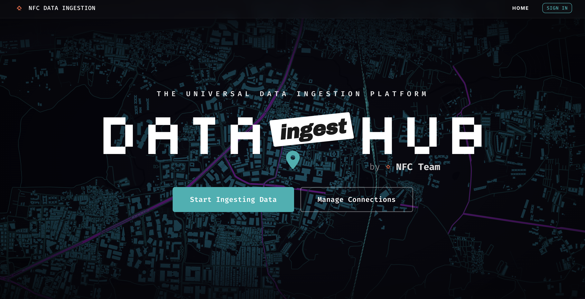
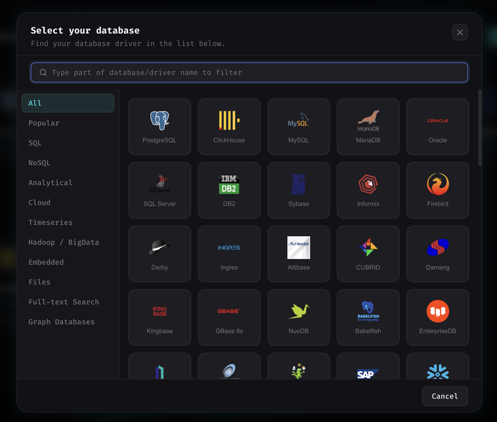
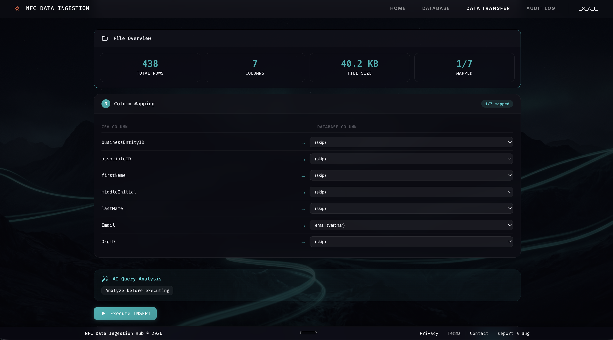
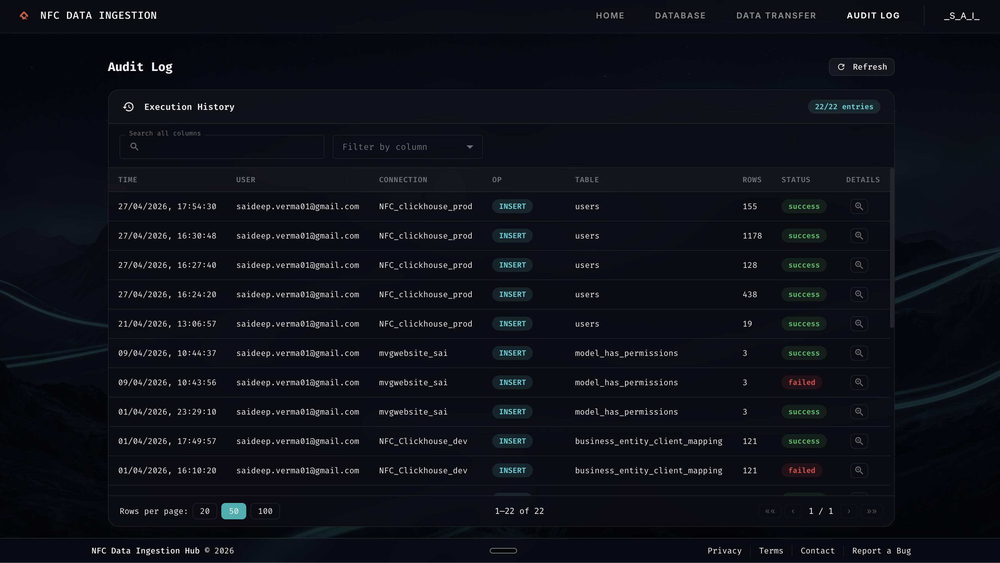

# NFC Data Ingestion Service

A self-service data ingestion platform with AI-powered query analysis and audit trails.

## Highlights

### Home
Landing page introducing the platform with a summary of key capabilities and a call to action.




### Database Connections
Manage all your database connections in one place. Supports 30+ databases with SSL, SSH tunnel, and live connection testing.



### Data Transfer
Upload a CSV, map columns to your target table, and execute bulk INSERT/UPSERT operations with real-time execution stats and an optional AI risk analysis before you run.



### Top 10 Problems Section
Highlights the core data engineering pain points this platform is built to solve — from manual ingestion scripts to lack of audit visibility.


### Audit Log
Every operation is logged with user, connection, table, row count, status, and a tamper-evident hash chain for full traceability.



## Features

- Google OAuth authentication
- Multi-database support: PostgreSQL, ClickHouse, Sybase (stub)
- CSV upload with column mapping UI
- AI query analyzer (risk, optimization, cost estimation)
- Full audit log of all operations

## Architecture

```
backend/     → FastAPI (Python)
frontend/    → React + TypeScript (Vite)
users/       → Legacy standalone scripts
```

## Quick Start

### Backend
```bash
cd backend
cp .env.example .env   # fill in credentials
pip3 install -r requirements.txt
uvicorn app.main:app --reload --port 8000
```

### Frontend
```bash
cd frontend
npm install
npm run dev -- --port 5173
```

App runs at http://localhost:5173, API at http://localhost:8000.

> **Note:** The frontend Vite config proxies all `/api` requests to `http://localhost:8000`, so the backend must be running first.

## Google OAuth Setup

1. Go to [Google Cloud Console](https://console.cloud.google.com/apis/credentials)
2. Create OAuth 2.0 credentials (Web application)
3. Set authorized redirect URI to `http://localhost:8000/api/auth/callback`
4. Add client ID and secret to `backend/.env`
